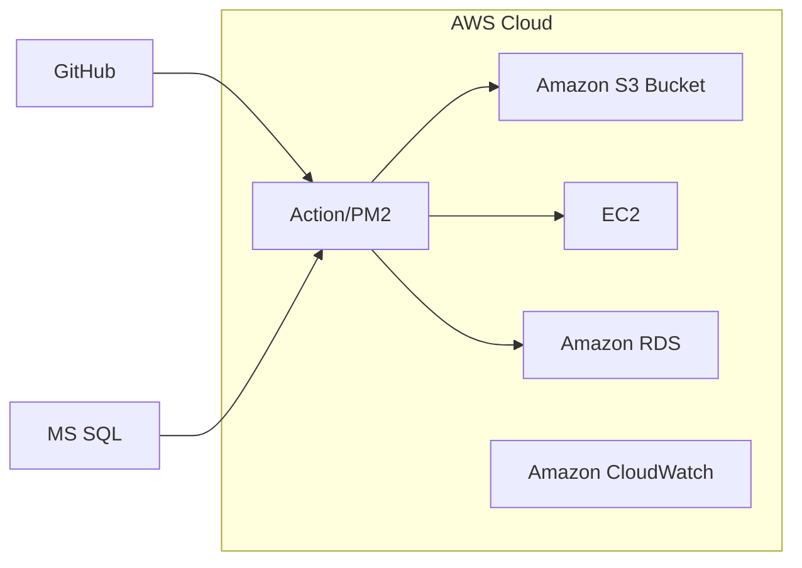
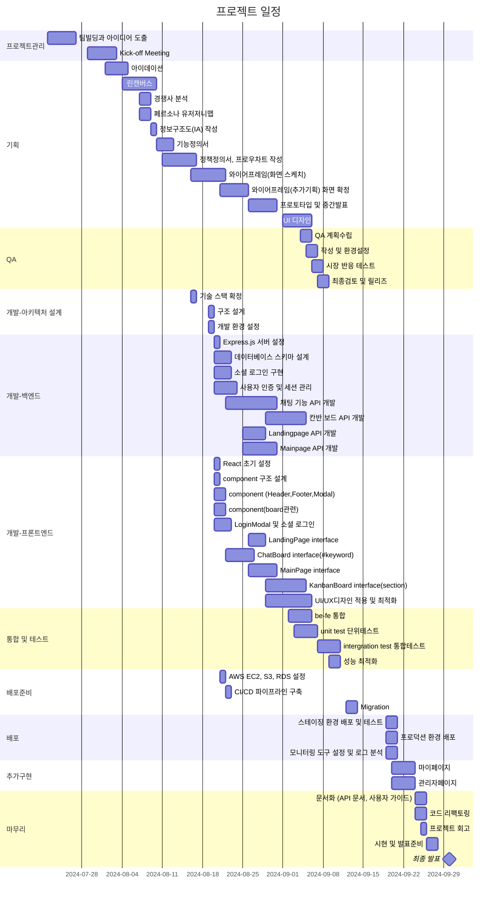
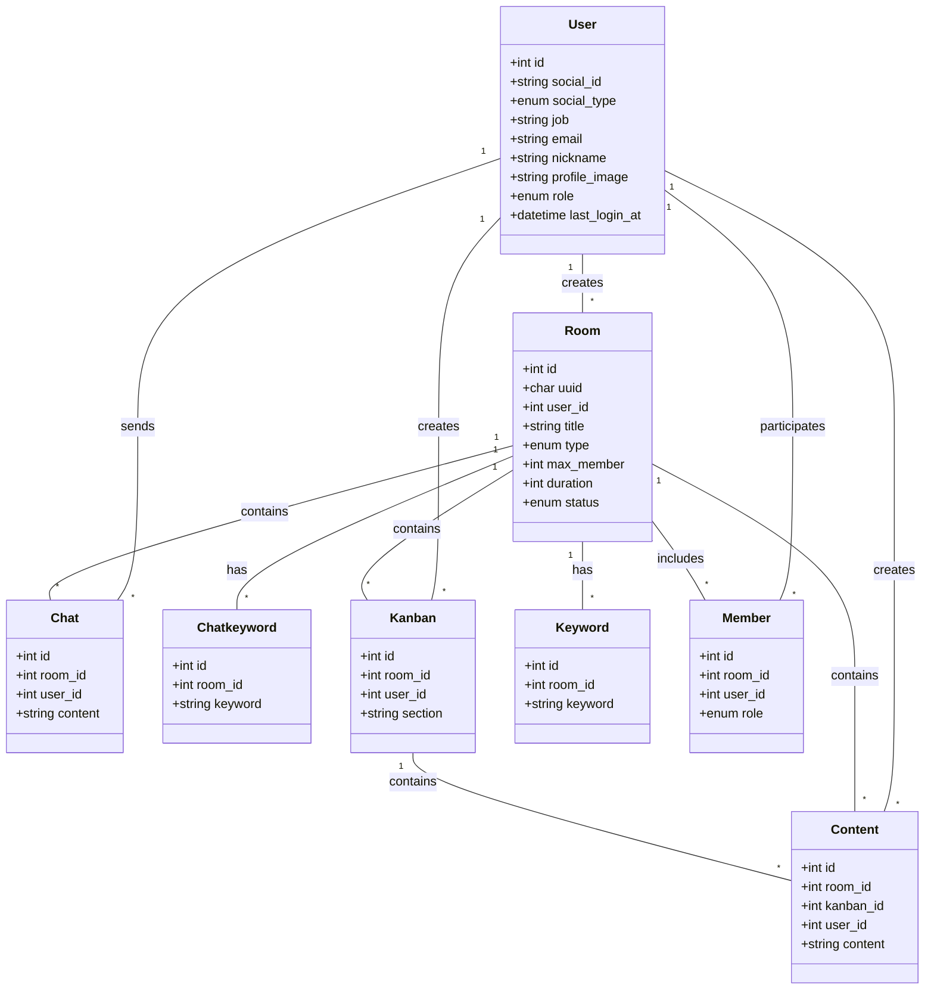
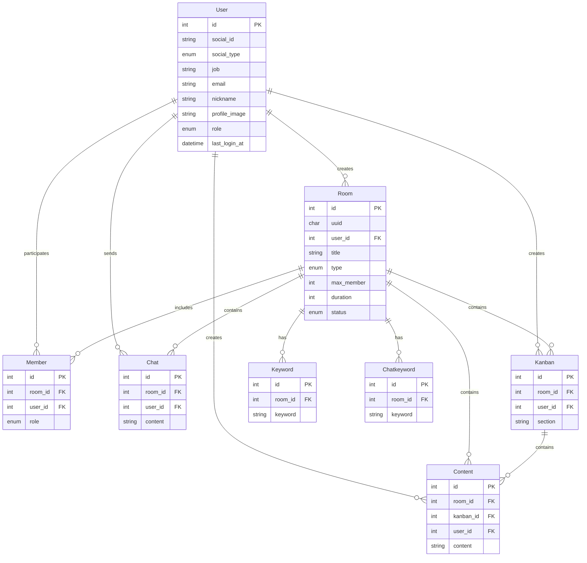

# obok team's project

"Razvery"<br>
<br>
단순 브레인스토밍을 떠나 마인드맵의 시각화, 만다라트 등 다양한 아이디어를 분야별 사람들 또는 새로운 영역의 아이디어를 실시간 공유하는 서비스.
참여자들은 닉네임(XXX[분야선택], XXX개발자)을 통해 자신의 전문분야를 바탕으로 주제에서 비롯한 다양한 생각을 호스트와 함께 참여한 유저간 공유한다. <br>
실시간 협업을 통해 즉시 문제를 처리하여 보다 빠른 Ideation이 가능하다.
또한 제한시간으로 인해 길어지는 불필요한 시간의 연장을 차단한다. 나아가 호스트는 제시한 내용을 바탕으로 팀웍등을 원할시 참여했던 유저에게 요청으로 통해 추가업무가 가능하다. 현재 구현할 서비스의 핵심기능은 브레인스토밍채팅과 보드 형태이다.<br>
<br>
ex) "커피업체의 친환경 제품"라는 주제로 한다면, 사용자들([학생], [물리학자], [IT개발자], [바리스타]등)은 각자 아이디어를 입력하고, 다른 사람들과 실시간으로 토론, 또는 키워드를 입력하며발전시킬 수 있음. AI를 접목시킨다면 관련된 최신 기술 트렌드나 기존 제품 사례를 제공해주고, 사용자는 이를 참고해 아이디어를 구체화할 수 있음.
<br>

# 팀에 대한 설명

기획팀: 김상윤, 윤상수<br>
개발팀: 박초롱, 변윤석<br>
<br>

# 프로젝트 기획

<br>
<br>

# 기술 스택 및 라이브러리, 개발 환경

1. Frontend
   React <br>
   -TailwindCSS, Bootstrap<br>
2. Backend
   Express.js<br>
3. Database
   MySQL<br>
   <br>

# AWS 배포

url:<br>



GitHub에서 Action/PM2로 코드 푸시 및 배포<br>
MS SQL에서 Action/PM2를 통해 데이터 마이그레이션<br>
Action/PM2에서 프론트엔드 파일을 S3 Bucket으로 배포<br>
Action/PM2에서 백엔드 코드를 EC2로 배포<br>
Action/PM2에서 데이터베이스 스키마 및 데이터를 Amazon RDS로 마이그레이션<br>
Amazon CloudWatch를 사용하여 전체 시스템 모니터링<br>

<br>

# WBS



<br>

# 폴더 구조

```bash
client/
├── public/
│   ├── images/
│   └── index.html
├── src/
│   ├── components/
│   │   ├── CreateRoomModal.tsx
│   │   ├── ChatKeyword.tsx
│   │   ├── ChatbotButton.tsx
│   │   ├── MemberList.tsx
│   │   ├── RoomInfo.tsx
│   │   ├── Footer.tsx
│   │   ├── Header.tsx
│   │   └── LoginModal.tsx
│   ├── contexts/
│   │   └── AuthContext.tsx
│   ├── hooks/
│   │   ├── useAuth.ts
│   │   ├── useRoom.ts
│   │   └── useForm.ts
│   ├── pages/
│   │   ├── chatboard/
│   │   │   ├── ChatBoard.tsx
│   │   │   └── index.tsx
│   │   ├── about/
│   │   │   ├── AboutPage.tsx
│   │   │   └── index.tsx
│   │   ├── mypage/
│   │   │   ├── MyPage.tsx
│   │   │   └── index.tsx
│   │   ├── kanbanboard/
│   │   │   ├── KanbanBoard.tsx
│   │   │   └── index.tsx
│   │   ├── landingpage/
│   │   │   ├── LandingPage.tsx
│   │   │   └── index.tsx
│   │   └── mainpage/
│   │       ├── MainPage.tsx
│   │       └── index.tsx
│   ├── styles/
│   │   └── tailwind.css
│   ├── App.tsx
│   ├── index.css
│   └── index.tsx
├── package.json
└── tsconfig.json

server/
├── src/
│   ├── config/
│   │   └── config.js
│   ├── controllers/
│   │   ├── authController.js
│   │   ├── roomController.js
│   │   └── chatController.js
│   ├── middlewares/
│   │   └── index.js
│   ├── models/
│   │   ├── index.js
│   │   ├── chat.js
│   │   ├── content.js
│   │   ├── kanban.js
│   │   ├── keyword.js
│   │   ├── member.js
│   │   ├── chatkeyword.js
│   │   ├── room.js
│   │   └── user.js
│   ├── routes/
│   │   ├── authRoute.js
│   │   ├── roomRoute.js
│   │   └── chatRoute.js
│   ├── passports/
│   │   ├── index.js
│   │   └── googleStrategy.js
│   ├── utils/
│   │   ├── logger.js
│   │   └── validators.js
│   └── app.js
├── tests/
│   ├── unit/
│   └── integration/
├── .env
├── .gitignore
├── package.json
└── server.js
```

<br>

# 페이지 구조

### LandingPage

- 설명: 웹사이트의 메인 페이지
- 주요 기능: 서비스 소개, 시작하기 버튼, FAQ

### MainPage

- 설명: 로그인 후 메인 대시보드
- 주요 기능: 사용자의 방 목록, 새 방 만들기

### ChatBoard

- 설명: 채팅 기능을 제공하는 페이지
- 주요 기능: 실시간 채팅, 키워드 표시

### KanbanBoard

- 설명: 칸반 보드 기능을 제공하는 페이지
- 주요 기능: 작업 항목 관리, 드래그 앤 드롭

### MyPage

- 설명: 사용자 개인 정보 및 설정 페이지
- 주요 기능: 프로필 수정, 활동 내역 확인

### AboutPage

- 설명: 서비스에 대한 상세 정보 페이지
- 주요 기능: 서비스 소개

<br>

# URL 구조

|
페이지  
|
URL  
|
설명  
|
|

---

## |

## |

|
|
LandingPage
|
/  
|
웹사이트 메인 페이지  
|
|
MainPage  
|
/main  
|
로그인 후 메인 대시보드  
|
|
ChatBoard  
|
/chat/:roomId  
|
특정 채팅방 페이지  
|
|
KanbanBoard
|
/kanban/:roomId  
|
특정 칸반 보드 페이지  
|
|
MyPage  
|
/mypage  
|
사용자 개인 정보 및 설정 페이지  
|
|
AboutPage  
|
/about  
|
서비스 소개 및 정보 페이지  
|

<br>

# 클래스 다이어그램



<br>

# ERD



# 트러블 슈팅

<br>

# 회고

<br>
<br>
<br>
