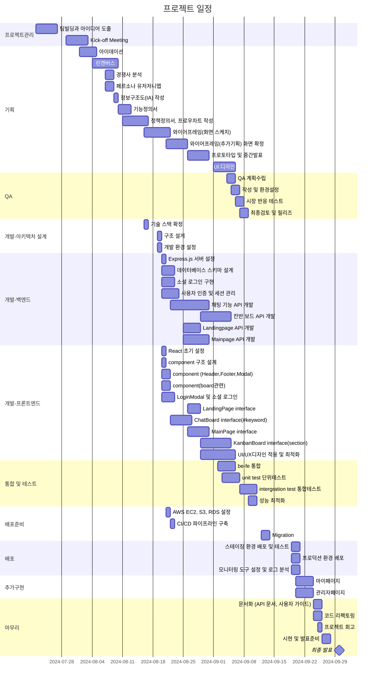

# Razvery - 프론트엔드

"Razvery"는 실시간으로 아이디어를 공유하는 서비스입니다. 제한 시간이 있는 채팅과 포스트잇 보드 형태가 핵심 기능입니다.
<br>
관리자 백오피스 구축으로 직관적인 대시보드로 핵심 지표 실시간 모니터링이 가능하여 사용자 관리가 용이합니다.
<br>

### 목차

1. 프로젝트 소개
2. 팀 소개 및 링크
3. 프로젝트 기획(FE)
4. 기술 스택 및 라이브러리
5. 시현 영상(FE)
6. WBS(FE)
7. 폴더 구조
8. 페이지 및 URL 구조(FE)
9. 시퀀스 다이어그램(BE)
10. 클래스 다이어그램(BE)
11. ERD(BE)
12. AWS배포(BE)
13. 트러블 슈팅
14. 회고(BE)

## 팀 소개

- 기획팀: 김상윤, 윤상수
- 개발팀: 박초롱, 변윤석
  <br>
  링크 <br>
- url: [Razvery 🍓](https://razvery.link/) <br>
- Frontend: https://github.com/obokproject/razvery-fe <br>
- Backend: https://github.com/obokproject/be-test <br>

## 프로젝트 기획

- 경쟁사 분석<br>
- 기능정의서<br>
- 유저저니맵, 페르소나<br>
- 화면흐름도<br>
- [코딩 컨벤션/ 폴더구조/ GitHub 전략](https://mathdev-park.notion.site/GitHub-Flow-32f89991bd0442eca822662076da1a9c?pvs=4)

<br>

## 기술 스택 및 라이브러리

- 
- 
- 

## 시현영상


<br>


<br>

## WBS



<br>

## 폴더 구조

```bash
client/
├── github/  # GitHub 관련 설정. CI/CD 워크플로우
├── public/     # 정적 파일 (HTML, 이미지 등)
├── src/
│   ├── components/ # 재사용 가능한 React 컴포넌트
│   ├── contexts/   # AuthContext
│   ├── hooks/      # 커스텀 React Hooks
│   ├── pages/
│   │   ├── chatboard/  # 베리톡(채팅페이지)
│   │   ├── about/      # 소개페이지
│   │   ├── mypage/     # 마이페이지
│   │   ├── notfound/   # 404 Not Found 페이지
│   │   ├── kanbanboard/    # 베리보드(드래그앤드롭 페이지)
│   │   ├── landingpage/    # 랜딩페이지
│   │   └── mainpage/   # 메인페이지(보드, 톡 방들 만들거나 참여)
│   └── styles/     # 전역스타일 및 스타일 관련 파일
├── package.json
└── tsconfig.json
```

<br>

## 페이지 및 URL 구조

| 페이지      | URL             | 설명                                       | 주요 기능                                              |
| ----------- | --------------- | ------------------------------------------ | ------------------------------------------------------ |
| LandingPage | /               | 웹사이트의 메인 페이지, 로그인 및 입장하기 | - 서비스 소개<br>- 시작하기 버튼<br>- FAQ              |
| MainPage    | /main           | 로그인 후 메인 대시보드                    | - 사용자의 방 목록<br>- 새 방 만들기                   |
| ChatBoard   | /chat/:roomId   | 베리 톡(채팅방) 페이지                     | - 실시간 채팅<br>- 키워드 표시                         |
| KanbanBoard | /kanban/:roomId | 베리 보드(포스트잇) 페이지                 | - 섹션 별 카드<br>- 드래그 앤 드롭                     |
| MyPage      | /mypage         | 사용자 개인 정보 및 설정 페이지            | - 프로필 수정<br>- 활동 내역 확인                      |
| AboutPage   | /about          | 서비스 소개 및 정보 페이지                 | - 서비스 소개                                          |
| AdminPage   | /admin          | 관리자 페이지                              | - 유저 조회 및 소프트 삭제 <br>- 월별 사용자 유입 통계 |

<br>

## 트러블 슈팅

- 실시간 양방향 통신: Socket.io를 사용한 실시간 업데이트 구현
- 포스트잇 기능: react-dnd 사용, <br>
  다수의 사용자가 이동할 시에 socket안정성 문제는 호스트만 이동하는 것으로 전환
- React-beautiful-dnd가 적용되지 않는 문제: stricmode에서 적용되지 않아 제거 또는 주석처리함
- 페이지 이동시 스크롤이 고정되는 이슈 (푸터에서 페이지라우팅하면 하단에 고정)
  원인: React (SPA) Router의 기본 동작과 브라우저의 기본 동작의 충돌<br>
  해결: scrollto(0,0) 컴포넌트 추가함 <br>
  <br>
