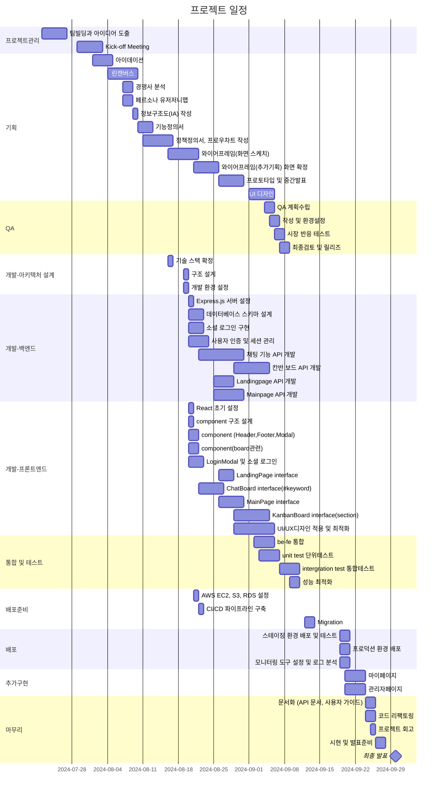
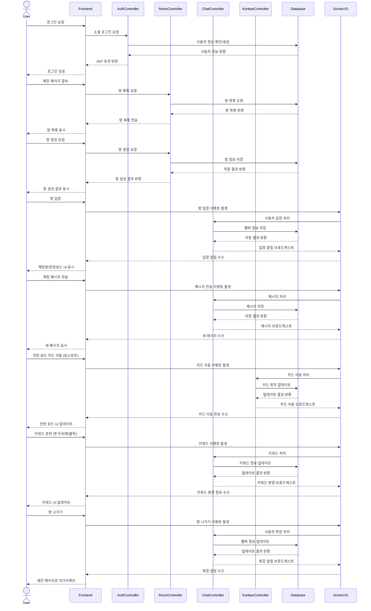
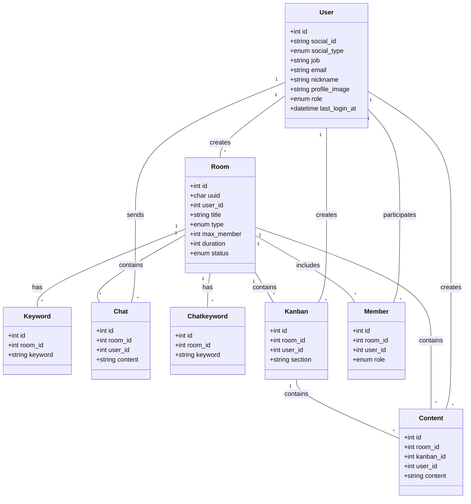
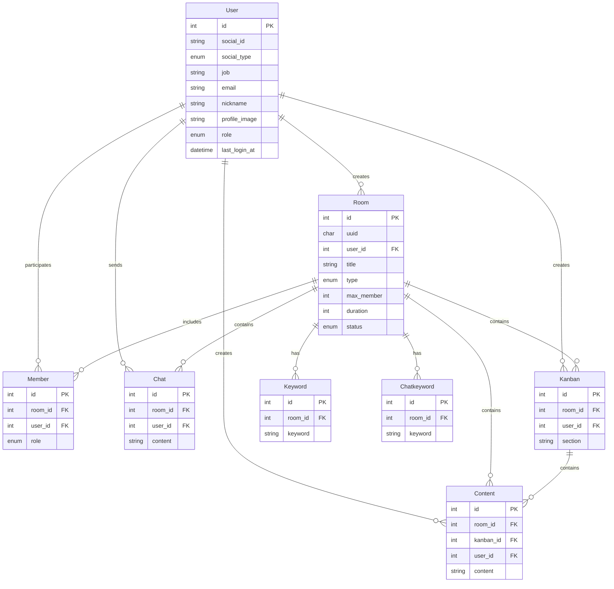
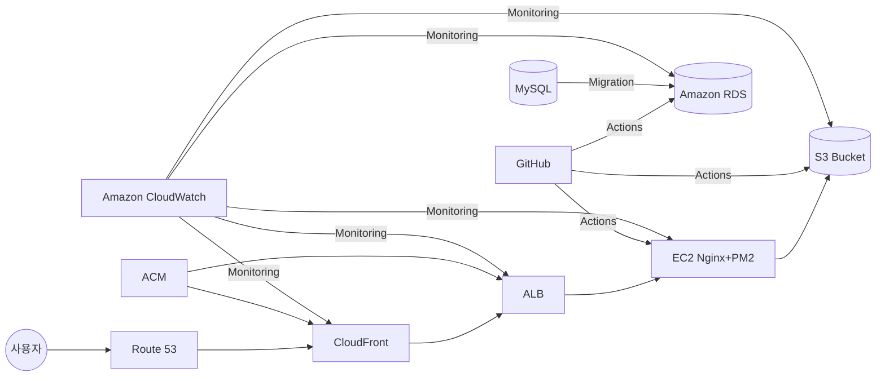

# Razvery - 프론트엔드

"Razvery"는 실시간으로 아이디어를 공유하는 서비스입니다. <br>
제한 시간이 있는 채팅과 포스트잇 보드 형태가 핵심 기능입니다.<br>
관리자 백오피스 구축으로 직관적인 대시보드로 핵심 지표 실시간 모니터링이 가능하여 사용자 관리가 용이합니다.
<br>

### 목차

1. 프로젝트 소개
2. [팀 소개 및 기술스택](https://github.com/obokproject/razvery-fe?tab=readme-ov-file#팀-소개-및-기술스택)
3. [링크](https://github.com/obokproject/razvery-fe?tab=readme-ov-file#링크)
4. [프로젝트 기획](https://github.com/obokproject/razvery-fe?tab=readme-ov-file#프로젝트-기획-목차)
5. [시연 영상](https://github.com/obokproject/razvery-fe?tab=readme-ov-file#시연-영상-목차)
6. [WBS](https://github.com/obokproject/razvery-fe?tab=readme-ov-file#WBS-목차)
7. [폴더 구조](https://github.com/obokproject/razvery-fe?tab=readme-ov-file#폴더-구조-목차)
8. [페이지 및 URL 구조](https://github.com/obokproject/razvery-fe?tab=readme-ov-file#페이지-및-URL-구조-목차)
9. [API 문서화](https://github.com/obokproject/razvery-fe?tab=readme-ov-file#API-문서화)
10. [시퀀스 다이어그램](https://github.com/obokproject/razvery-fe?tab=readme-ov-file#시퀀스-다이어그램-목차)
11. [클래스 다이어그램](https://github.com/obokproject/razvery-fe?tab=readme-ov-file#클래스-다이어그램-목차)
12. [ERD](https://github.com/obokproject/razvery-fe?tab=readme-ov-file#ERD-목차)
13. [AWS 배포](https://github.com/obokproject/razvery-fe?tab=readme-ov-file#AWS-배포-목차)
14. [트러블 슈팅](https://github.com/obokproject/razvery-fe?tab=readme-ov-file#트러블-슈팅-목차)
15. [회고](https://github.com/obokproject/razvery-fe?tab=readme-ov-file#회고)

## 팀 소개 및 기술 스택

- 기획팀: 김상윤, 윤상수
- 개발팀: 박초롱, 변윤석
  <br>
    <br>
   

## 링크

- 데모 url : [Razvery 🍓](https://razvery.link/) <br>
- Frontend 레포 : https://github.com/obokproject/razvery-fe <br>
- Backend 레포 : https://github.com/obokproject/be-test <br>
  <br>

## 프로젝트 기획 [목차](#목차)

- 경쟁사 분석<br>
- 기능정의서<br>
- 유저저니맵, 페르소나<br>
- 화면흐름도<br>
- [코딩 컨벤션/ 폴더구조/ GitHub 전략](https://mathdev-park.notion.site/GitHub-Flow-32f89991bd0442eca822662076da1a9c?pvs=4)
  <br>

## 시연 영상 [목차](#목차)


<br>

<br>

## WBS [목차](#목차)



## 폴더 구조 [목차](#목차)

```bash
client/
├── github/                 # GitHub 관련 설정. CI/CD 워크플로우
├── public/                 # 정적 파일 (HTML, 이미지 등)
├── src/
│   ├── components/         # 재사용 가능한 React 컴포넌트
│   ├── contexts/           # AuthContext
│   ├── hooks/              # 커스텀 React Hooks
│   ├── pages/
│   │   ├── chatboard/      # 베리톡(채팅페이지)
│   │   ├── about/          # 소개페이지
│   │   ├── mypage/         # 마이페이지
│   │   ├── notfound/       # 404 Not Found 페이지
│   │   ├── kanbanboard/    # 베리보드(드래그앤드롭 페이지)
│   │   ├── landingpage/    # 랜딩페이지
│   │   └── mainpage/       # 메인페이지(보드, 톡 방들 만들거나 참여)
│   └── styles/             # 전역스타일 및 스타일 관련 파일
├── package.json
└── tsconfig.json

server/
├── github/             # GitHub 관련 설정. CI/CD 워크플로우
├── src/
│   ├── config/         # 애플리케이션 설정 파일
│   ├── controllers/    # 요청 처리 및 응답 로직
│   ├── middlewares/    # 미들웨어 함수들
│   ├── models/         # 데이터베이스 모델 및 스키마
│   ├── routes/         # API 라우트 정의
│   ├── passports/      # 인증전략
│   └── utils/          # logger, validator
├── tests/              # 테스트 파일 (TDD를 위한)
├── package.json
└── server.js
```

<br>

## 페이지 및 URL 구조 [목차](#목차)

| 페이지      | URL             | 설명                                       | 주요 기능                                              |
| ----------- | --------------- | ------------------------------------------ | ------------------------------------------------------ |
| LandingPage | /               | 웹사이트의 메인 페이지, 로그인 및 입장하기 | - 서비스 소개<br>- 시작하기 버튼<br>- FAQ              |
| MainPage    | /main           | 로그인 후 메인 대시보드                    | - 사용자의 방 목록<br>- 새 방 만들기                   |
| ChatBoard   | /chat/:roomId   | 베리 톡(채팅방) 페이지                     | - 실시간 채팅<br>- 키워드 표시                         |
| KanbanBoard | /kanban/:roomId | 베리 보드(포스트잇) 페이지                 | - 섹션 별 카드<br>- 드래그 앤 드롭                     |
| MyPage      | /mypage         | 사용자 개인 정보 및 설정 페이지            | - 프로필 수정<br>- 활동 내역 확인                      |
| AboutPage   | /about          | 서비스 소개 및 정보 페이지                 | - 서비스 소개                                          |
| AdminPage   | /admin          | 관리자 페이지                              | - 유저 조회 및 소프트 삭제 <br>- 월별 사용자 유입 통계 |

<br>

## API 문서화 [목차](#목차)


<br>

## 시퀀스 다이어그램 [목차](#목차)



<br>

## 클래스 다이어그램 [목차](#목차)



<br>

## ERD [목차](#목차)



<br>

## AWS 배포 [목차](#목차)



GitHub에서 Action/PM2로 코드 푸시 및 배포<br>
CloudFront는 ACM의 SSL 인증서를 사용해 HTTPS 연결을 제공<br>
MySQL에서 Action/PM2를 통해 데이터 마이그레이션<br>
Action/PM2에서 프론트엔드 파일을 S3 Bucket으로 배포<br>
Action/PM2에서 백엔드 코드를 EC2로 배포<br>
Action/PM2에서 데이터베이스 스키마 및 데이터를 Amazon RDS로 마이그레이션<br>
Amazon CloudWatch를 사용하여 전체 시스템 모니터링<br>

<br>

## 트러블 슈팅 [목차](#목차)

- 실시간 양방향 통신: Socket.io를 사용한 실시간 업데이트 구현<br>
- 채팅과 키워드 프론트엔드에서만 매핑하려다 키워드 삭제 후 재입장 시 매핑 불가: keyword 테이블에 chat_id 컬럼을 추가해 DB에서 매핑<br>
- 포스트잇 기능: <br>
  다수의 사용자가 이동할 시에 socket안정성 문제는 호스트만 이동하는 것으로 전환<br>
  중간에 최적화 과정에서 중간에 걸치거나 하는 식으로 원하는 곳으로 이동하지 않아 이상했는데 react-beautiful-dnd 사용 문제라는 것을 알게 됨. react-dnd는 가능한데 시간이 별로 남지 않아 기획을 바꾸지 않기로 함<br>
- 칸반 보드 순서가 드롭한 순서로 놓이지 않는 오류 - 정렬만 하게 해둬서 만들어진 순서와 아래에 붙이는 것으로 생각했었는데 중요도에 따라 위로 올릴수 있어서 DB 테이블에 order컬럼을 추가
- React-beautiful-dnd가 적용되지 않는 문제: stricmode에서 적용되지 않아 제거 또는 주석처리함<br>
- 페이지 이동시 스크롤이 고정되는 이슈 (푸터에서 페이지 라우팅하면 하단에 고정)<br>
  원인: React (SPA) Router의 기본 동작과 브라우저의 기본 동작의 충돌<br>
  해결: scrollto(0,0) 컴포넌트 추가함 <br>
  <br>
- 보안 HTTPS 적용하고 싶었으나 SSL인증서를 발급받지 못했지만 Route53을 시도해 보았음 <br>
  <br>

## 회고

- 박초롱: 이번 프로젝트는 개인적 성장의 측면에서는 배웠던 것 이상의 새로운 기술에 도전하면서 다양한 오류들을 마주했습니다. 많은 오류들을 해결해 나가며 기술적으로 성장할 수 있었고, 문제 해결 능력도 향상되었다고 느꼈습니다. 그리고 기술적인 도전뿐만 아니라 팀워크의 중요성을 동시에 경험할 수 있는 소중한 시간이었습니다. 물론 진행하며 기획팀과 개발팀 간의 '언어의 차이'를 느낀 적이 있었지만, 그럴때마다 팀원들 각자의 영역을 존중하고 어떻게 하면 더 잘 설명할 수 있을까 고민하고 개선해 나갔습니다. 이러한 서로를 보완하고 이해하는 과정들이 저희의 프로젝트의 완성도를 높이는 핵심 요소가 되었다고 생각합니다. <br>
- 변윤석: 프로젝트를 진행하면서 많은 배움을 얻을 수 있었고, 코드 로직에 대한 깊이 있는 이해를 쌓을 수 있는 귀중한 시간이었습니다.
  비록 부족한 부분도 있었지만, 훌륭한 팀원들과의 협업 덕분에 어려운 과제들을 함께 해결하며 끝까지 완성할 수 있었습니다.
  이 과정에서 팀워크의 중요성을 다시 한번 깨닫게 되었고, 앞으로도 성장할 수 있는 기반을 다진 것 같습니다<br>
- 김상윤: 명확한 사용자 페르소나 정의의 중요성과 기획 <br>
- 윤상수: 기획의 ㄱ도 모르는 상태로 시작했지만 하나의 결과물이 나와버렸습니다. 이게 되나 싶었는데 되네요.
  팀원 모두 처음 하시는 분들인데 너무 잘 해주셨고 덕분에 저도 생각 이상으로 해낼 수 있었던 것 같습니다.<br>
  <br>
  <br>

[목차](#목차)
