# Razvery - 프론트엔드

"Razvery"는 실시간으로 아이디어를 공유하는 서비스입니다. 제한 시간이 있는 채팅과 포스트잇 보드 형태가 핵심 기능입니다.
<br>
관리자 백오피스 구축으로 직관적인 대시보드로 핵심 지표 실시간 모니터링이 가능하여 사용자 관리가 용이합니다.
<br>

## 팀 소개

- 기획팀: 김상윤, 윤상수
- 개발팀: 박초롱, 변윤석
  <br>

## 프로젝트 기획

- 기능정의서<br>
- 유저저니맵, 페르소나<br>
- 화면흐름도<br>
  <br>

## 기술 스택 및 라이브러리

- React 
- TailwindCSS 
- Bootstrap 

## AWS 배포

url: [Razvery 🍓](https://razvery.link/) <br>


GitHub에서 Action/PM2로 코드 푸시 및 배포<br>
CloudFront는 ACM의 SSL 인증서를 사용해 HTTPS 연결을 제공<br>
MySQL에서 Action/PM2를 통해 데이터 마이그레이션<br>
Action/PM2에서 프론트엔드 파일을 S3 Bucket으로 배포<br>
Action/PM2에서 백엔드 코드를 EC2로 배포<br>
Action/PM2에서 데이터베이스 스키마 및 데이터를 Amazon RDS로 마이그레이션<br>
Amazon CloudWatch를 사용하여 전체 시스템 모니터링<br>

<br>

## WBS


<br>

## 폴더 구조

```bash
client/
├── public/
│   ├── images/
│   └── index.html
├── src/
│   ├── components/
│   │   ├── CreateRoomModal.tsx
│   │   ├── ChatKeyword.tsx
│   │   ├── ChatbotButton.tsx
│   │   ├── MemberList.tsx
│   │   ├── RoomInfo.tsx
│   │   ├── Footer.tsx
│   │   ├── Header.tsx
│   │   └── LoginModal.tsx
│   ├── contexts/
│   │   └── AuthContext.tsx
│   ├── hooks/
│   │   ├── useAuth.ts
│   │   ├── useRoom.ts
│   │   └── useForm.ts
│   ├── pages/
│   │   ├── chatboard/
│   │   │   ├── ChatBoard.tsx
│   │   │   └── index.tsx
│   │   ├── about/
│   │   │   ├── AboutPage.tsx
│   │   │   └── index.tsx
│   │   ├── mypage/
│   │   │   ├── MyPage.tsx
│   │   │   └── index.tsx
│   │   ├── kanbanboard/
│   │   │   ├── KanbanBoard.tsx
│   │   │   └── index.tsx
│   │   ├── landingpage/
│   │   │   ├── LandingPage.tsx
│   │   │   └── index.tsx
│   │   └── mainpage/
│   │       ├── MainPage.tsx
│   │       └── index.tsx
│   ├── styles/
│   │   └── tailwind.css
│   ├── App.tsx
│   ├── index.css
│   └── index.tsx
├── package.json
└── tsconfig.json
```

<br>

## 페이지 및 URL 구조

| 페이지      | URL             | 설명                                       | 주요 기능                                 |
| ----------- | --------------- | ------------------------------------------ | ----------------------------------------- |
| LandingPage | /               | 웹사이트의 메인 페이지, 로그인 및 입장하기 | - 서비스 소개<br>- 시작하기 버튼<br>- FAQ |
| MainPage    | /main           | 로그인 후 메인 대시보드                    | - 사용자의 방 목록<br>- 새 방 만들기      |
| ChatBoard   | /chat/:roomId   | 베리 톡(채팅방) 페이지                     | - 실시간 채팅<br>- 키워드 표시            |
| KanbanBoard | /kanban/:roomId | 베리 보드(포스트잇) 페이지                 | - 작업 항목 관리<br>- 드래그 앤 드롭      |
| MyPage      | /mypage         | 사용자 개인 정보 및 설정 페이지            | - 프로필 수정<br>- 활동 내역 확인         |
| AboutPage   | /about          | 서비스 소개 및 정보 페이지                 | - 서비스 소개                             |

<br>

## 클래스 다이어그램


<br>

## 시퀀스 다이어그램

```mermaid
sequenceDiagram
    actor User
    participant Frontend
    participant AuthController
    participant RoomController
    participant ChatController
    participant KanbanController
    participant Database
    participant WebSocket

    User->>Frontend: 로그인 요청
    Frontend->>AuthController: 소셜 로그인 요청
    AuthController->>Database: 사용자 정보 확인/생성
    Database-->>AuthController: 사용자 정보 반환
    AuthController-->>Frontend: JWT 토큰 반환
    Frontend-->>User: 로그인 성공

    User->>Frontend: 메인 페이지 접속
    Frontend->>RoomController: 방 목록 요청
    RoomController->>Database: 방 목록 조회
    Database-->>RoomController: 방 목록 반환
    RoomController-->>Frontend: 방 목록 전송
    Frontend-->>User: 방 목록 표시

    User->>Frontend: 방 생성 요청
    Frontend->>RoomController: 방 생성 요청
    RoomController->>Database: 방 정보 저장
    Database-->>RoomController: 저장 결과 반환
    RoomController-->>Frontend: 방 생성 결과 반환
    Frontend-->>User: 방 생성 결과 표시

    User->>Frontend: 방 입장
    Frontend->>WebSocket: 방 입장 이벤트 발생
    WebSocket->>ChatController: 사용자 입장 처리
    ChatController->>Database: 멤버 정보 저장
    Database-->>ChatController: 저장 결과 반환
    ChatController-->>WebSocket: 입장 알림 브로드캐스트
    WebSocket-->>Frontend: 입장 알림 수신
    Frontend-->>User: 채팅방 UI 표시

    User->>Frontend: 채팅 메시지 전송
    Frontend->>WebSocket: 메시지 전송 이벤트 발생
    WebSocket->>ChatController: 메시지 처리
    ChatController->>Database: 메시지 저장
    Database-->>ChatController: 저장 결과 반환
    ChatController-->>WebSocket: 메시지 브로드캐스트
    WebSocket-->>Frontend: 새 메시지 수신
    Frontend-->>User: 새 메시지 표시

    User->>Frontend: 칸반 보드 카드 이동
    Frontend->>WebSocket: 카드 이동 이벤트 발생
    WebSocket->>KanbanController: 카드 이동 처리
    KanbanController->>Database: 카드 위치 업데이트
    Database-->>KanbanController: 업데이트 결과 반환
    KanbanController-->>WebSocket: 카드 이동 브로드캐스트
    WebSocket-->>Frontend: 카드 이동 정보 수신
    Frontend-->>User: 칸반 보드 UI 업데이트

    User->>Frontend: 방 나가기
    Frontend->>WebSocket: 방 나가기 이벤트 발생
    WebSocket->>ChatController: 사용자 퇴장 처리
    ChatController->>Database: 멤버 정보 업데이트
    Database-->>ChatController: 업데이트 결과 반환
    ChatController-->>WebSocket: 퇴장 알림 브로드캐스트
    WebSocket-->>Frontend: 퇴장 알림 수신
    Frontend-->>User: 메인 페이지로 리다이렉트
```



<br>

## 트러블 슈팅

- 실시간 양방향 통신: Socket.io를 사용한 실시간 업데이트 구현
- 포스트잇 기능: react-dnd 사용, <br>
  다수의 사용자가 이동할 시에 socket안정성 문제는 호스트만 이동하는 것으로 전환
- React-beautiful-dnd가 적용되지 않는 문제: stricmode에서 적용되지 않아 제거 또는 주석처리함
- 페이지 이동시 스크롤이 고정되는 이슈 (푸터에서 페이지라우팅하면 하단에 고정)
  원인: React (SPA) Router의 기본 동작과 브라우저의 기본 동작의 충돌<br>
  해결: scrollto(0,0) 컴포넌트 추가함 <br>
  <br>

## 회고

<br>
<br>
<br>
