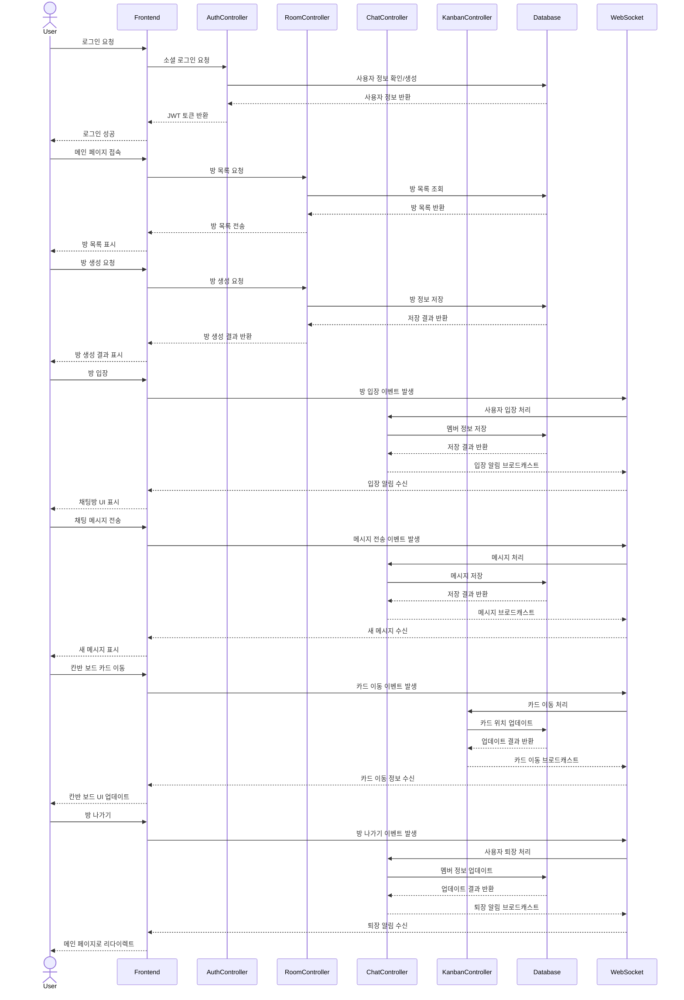

# Razvery - 프론트엔드

"Razvery"는 실시간으로 아이디어를 공유하는 서비스입니다. 제한 시간이 있는 채팅과 포스트잇 보드 형태가 핵심 기능입니다.
<br>

## 팀 소개

- 기획팀: 김상윤, 윤상수
- 개발팀: 박초롱, 변윤석
  <br>

## 프로젝트 기획

- 기능정의서<br>
- 유저저니맵, 페르소나<br>
- 화면흐름도<br>
  <br>

## 기술 스택 및 라이브러리

- React
- TailwindCSS
- Bootstrap

## AWS 배포

url: razvery.link<br>


GitHub에서 Action/PM2로 코드 푸시 및 배포<br>
CloudFront는 ACM의 SSL 인증서를 사용해 HTTPS 연결을 제공<br>
MySQL에서 Action/PM2를 통해 데이터 마이그레이션<br>
Action/PM2에서 프론트엔드 파일을 S3 Bucket으로 배포<br>
Action/PM2에서 백엔드 코드를 EC2로 배포<br>
Action/PM2에서 데이터베이스 스키마 및 데이터를 Amazon RDS로 마이그레이션<br>
Amazon CloudWatch를 사용하여 전체 시스템 모니터링<br>

<br>

## WBS


<br>

## 폴더 구조

```bash
client/
├── public/
│   ├── images/
│   └── index.html
├── src/
│   ├── components/
│   │   ├── CreateRoomModal.tsx
│   │   ├── ChatKeyword.tsx
│   │   ├── ChatbotButton.tsx
│   │   ├── MemberList.tsx
│   │   ├── RoomInfo.tsx
│   │   ├── Footer.tsx
│   │   ├── Header.tsx
│   │   └── LoginModal.tsx
│   ├── contexts/
│   │   └── AuthContext.tsx
│   ├── hooks/
│   │   ├── useAuth.ts
│   │   ├── useRoom.ts
│   │   └── useForm.ts
│   ├── pages/
│   │   ├── chatboard/
│   │   │   ├── ChatBoard.tsx
│   │   │   └── index.tsx
│   │   ├── about/
│   │   │   ├── AboutPage.tsx
│   │   │   └── index.tsx
│   │   ├── mypage/
│   │   │   ├── MyPage.tsx
│   │   │   └── index.tsx
│   │   ├── kanbanboard/
│   │   │   ├── KanbanBoard.tsx
│   │   │   └── index.tsx
│   │   ├── landingpage/
│   │   │   ├── LandingPage.tsx
│   │   │   └── index.tsx
│   │   └── mainpage/
│   │       ├── MainPage.tsx
│   │       └── index.tsx
│   ├── styles/
│   │   └── tailwind.css
│   ├── App.tsx
│   ├── index.css
│   └── index.tsx
├── package.json
└── tsconfig.json
```

<br>

## 페이지 및 URL 구조

| 페이지      | URL             | 설명                                       | 주요 기능                                 |
| ----------- | --------------- | ------------------------------------------ | ----------------------------------------- |
| LandingPage | /               | 웹사이트의 메인 페이지, 로그인 및 입장하기 | - 서비스 소개<br>- 시작하기 버튼<br>- FAQ |
| MainPage    | /main           | 로그인 후 메인 대시보드                    | - 사용자의 방 목록<br>- 새 방 만들기      |
| ChatBoard   | /chat/:roomId   | 베리 톡(채팅방) 페이지                     | - 실시간 채팅<br>- 키워드 표시            |
| KanbanBoard | /kanban/:roomId | 베리 보드(포스트잇) 페이지                 | - 작업 항목 관리<br>- 드래그 앤 드롭      |
| MyPage      | /mypage         | 사용자 개인 정보 및 설정 페이지            | - 프로필 수정<br>- 활동 내역 확인         |
| AboutPage   | /about          | 서비스 소개 및 정보 페이지                 | - 서비스 소개                             |

<br>

## 클래스 다이어그램


<br>

## ERD


<br>

## 시퀀스 다이어그램



<br>

## 트러블 슈팅

- 실시간 양방향 통신: Socket.io를 사용한 실시간 업데이트 구현
- 포스트잇 기능: react-dnd 사용, <br>
  다수의 사용자가 이동할 시에 socket안정성 문제는 호스트만 이동하는 것으로 전환
  <br>

## 회고

<br>
<br>
<br>
